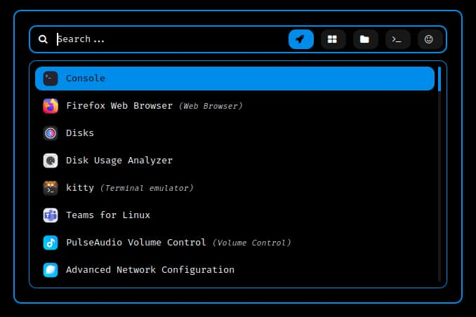

<div align = "center">

<h1><a href="https://github.com/2kabhishek/rofi2k">rofi2k</a></h1>

<a href="https://github.com/2KAbhishek/rofi2k/blob/main/LICENSE">
 </a>

<a href="https://github.com/2KAbhishek/rofi2k/graphs/contributors">
 </a>

<a href="https://github.com/2KAbhishek/rofi2k/stargazers">
</a>

<a href="https://github.com/2KAbhishek/rofi2k/network/members">
 </a>

<a href="https://github.com/2KAbhishek/rofi2k/watchers">
 </a>

<a href="https://github.com/2KAbhishek/rofi2k/pulse">
 </a>

<h3>Your Universal Launchpad 🛸🚀</h3>

<figure>
  
  <br/>
  <figcaption>rofi2k screenshot</figcaption>
</figure>

</div>

rofi2k is an universal application launcher based on rofi, has modern and minimalistic aesthetics.

## ✨ Features

- Launch any application on your system
- Window switcher with workspace support
- Explore and edit all files on your system
- Search and insert emojis

## Setup

### ⚡ Requirements

- [rofi](https://github.com/davatorium/rofi)
- [rofi-emoji](https://github.com/Mange/rofi-emoji) for using emoji search
- [rofi-calc](https://github.com/svenstaro/rofi-calc) for using calculator

### 🚀 Installation

```bash
git clone https://github.com/2kabhishek/rofi2k
# Install
ln -sfnv $PWD/rofi2k ~/.config/rofi
# Run
rofi -show
```

If you already have a rofi config, append the lines in `config.rasi` and copy over `themes`.

### 💻 Usage

To run rofi do `rofi -show mode`

#### 🤖 Modes

- drun: Launch apps
- window: Window switcher
- filebrowser: File explorer
- run: Launch commands
- emoji: Emoji search
- calc: Calculator
- ssh: Manage SSH sessions
- combi: Combo modes
- keys: Keyboard shortcuts

By default drun, window, filebrowser and run modes are enabled, to add more simply edit the [config.rasi](./config.rasi) file

#### ⌨️ Keybindings

You can invoke `rofi` directly from the command line, but it is recommended to have a keybinding configured.

Here's my recommended key bindings

| Keybinding | Description | Command |
| ---------- | ----------- | --------|
| <kbd>Super</kbd> + <kbd>Space</kbd> | Application Launcher | `rofi -show drun` |
| <kbd>Super</kbd> + <kbd>Tab</kbd> | Window Switcher | `rofi -show window` |
| <kbd>Super</kbd> + <kbd>.</kbd> | Emoji Search | `rofi -show emoji` |

## What's Next

Planning to add more useful panels.

##  Behind The Code

### 🌈 Inspiration

rofi2k was inspired by posts on r/unixporn and a need for a functional application launcher.

### 💡 Challenges/Learnings

- Battling my OCD of trying to get everything just right. 😆
- Learned about the rofi ecosystem

### 🧰 Tooling

- [dots2k](https://github.com/2kabhishek/dots2k) — Dev Environment
- [nvim2k](https://github.com/2kabhishek/nvim2k) — Personalized Editor
- [awesome2k](https://github.com/2kabhishek/awesome2k) — Tiling Window Manager

<hr>

<div align="center">

<strong>⭐ hit the star button if you found this useful ⭐</strong><br>

<a href="https://github.com/2KAbhishek/BareMinimum">Source</a>
| <a href="https://2kabhishek.github.io/blog" target="_blank">Blog </a>
| <a href="https://twitter.com/2kabhishek" target="_blank">Twitter </a>
| <a href="https://linkedin.com/in/2kabhishek" target="_blank">LinkedIn </a>
| <a href="https://2kabhishek.github.io/links" target="_blank">More Links </a>
| <a href="https://2kabhishek.github.io/projects" target="_blank">Other Projects </a>

</div>

