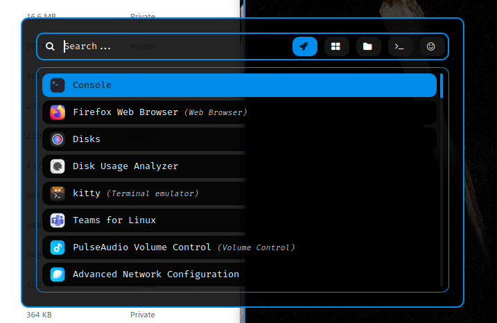

<div align = "center">

<h1><a href="https://2kabhishek.github.io/rofi2k">rofi2k</a></h1>

<a href="https://github.com/2KAbhishek/rofi2k/blob/main/LICENSE">
 </a>

<a href="https://github.com/2KAbhishek/rofi2k/graphs/contributors">
 </a>

<a href="https://github.com/2KAbhishek/rofi2k/stargazers">
</a>

<a href="https://github.com/2KAbhishek/rofi2k/network/members">
 </a>

<a href="https://github.com/2KAbhishek/rofi2k/watchers">
 </a>

<a href="https://github.com/2KAbhishek/rofi2k/pulse">
 </a>

<h3>Your Universal Launchpad 🛸🚀</h3>

<figure>
  
  <br/>
  <figcaption>rofi2k screenshot</figcaption>
</figure>

</div>

## What is this

rofi2k is an universal application launcher based on rofi, has modern and minimalistic aesthetics.

## Inspiration

rofi2k was inspired by posts on r/unixporn.

Wanted something both functional and pretty.

## Prerequisites

Before you begin, ensure you have met the following requirements:

- You have installed the latest version of `rofi`

## Getting rofi2k

To get rofi2k, follow these steps:

```bash
git clone https://github.com/2kabhishek/rofi2k
cd rofi2k
# Install
ln -sfnv $PWD/rofi2k ~/.config/rofi
```

If you already have a rofi config, append the lines in `config.rasi` and copy over `themes`.

## Using rofi2k

You can invoke `rofi` directly from the command line, but it is recommended to have a keybinding configured.

My recommended binding is <kbd>Super</kbd> + <kbd>a</kbd>.

If you want to look at examples, check `keys.lua` in [awesome2k](https://github.com/2kabhishek/awesome2k)

## How it was built

rofi2k was built using `nvim`

## Challenges faced

Battling my OCD of trying to get everything just right. 😆

## What I learned

- Learned about the rofi ecosystem

## What's next

You tell me!.

Hit the ⭐ button if you found this useful.

## More Info

- My awesome wm configs [awesome2k](https://github.com/2kabhishek/awesome2k)
- Parent [Dotfiles](https://github.com/2kabhishek/Dotfiles)

<div align="center">

<a href="https://github.com/2KAbhishek/rofi2k">Source</a> | <a href="https://2kabhishek.github.io/rofi2k">Website</a>

</div>
